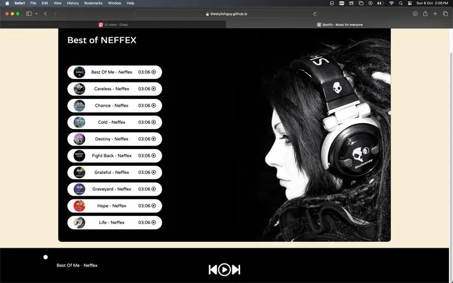

# Spotify Clone 🎵

_Spotify is a music player website/app, on this website/app you can listen to your any favourite music. I cloned just the layout of spotify using HTML, CSS and JAVASCRIPT to learn the concepts of web development more clearly 🖤._

## Screenshots for preview ✨

## Built With ❤️

* [**HTML**](https://en.wikipedia.org/wiki/HTML) - _I used HTML in my Spotify clone to make CSS and JS file work in the website and also to make a skeleton of the website._
* [**CSS**](https://en.wikipedia.org/wiki/CSS) - _I used CSS for adding awesome and attractive designs to my website._
* [**JavaScript**](https://en.wikipedia.org/wiki/JavaScript) - _I used JavaScript to make the Spotify music player work logically perfect._

## Contributing 🥀

_When contributing to this repository, please first discuss the change you wish to make via issue, email, or any other method with the owners of this repository before making a change._

## Pull Request Process 🌟

_1. Ensure any install or build dependencies are removed before the end of the layer when doing a build._

2. _Update the README.md with details of changes to the interface, this includes new environment variables, exposed ports, useful file locations and container parameters._

3. _You may merge the Pull Request in once you have the sign-off of two other developers, or if you do not have permission to Spotify Clone._

## Authors 💜

* **Arjun 💗** - *Initial work* - [Arjun](https://github.com/thestylishguy)

## License

_This project is licensed under the MIT License - see the [**LICENSE**](https://github.com/thestylishguy/SpotifyClone/blob/d76390d06494470eebaa714c26e6dfe3b0001047/LICENSE) file for more details._
